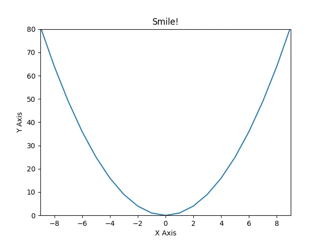
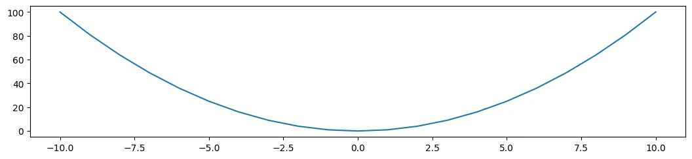
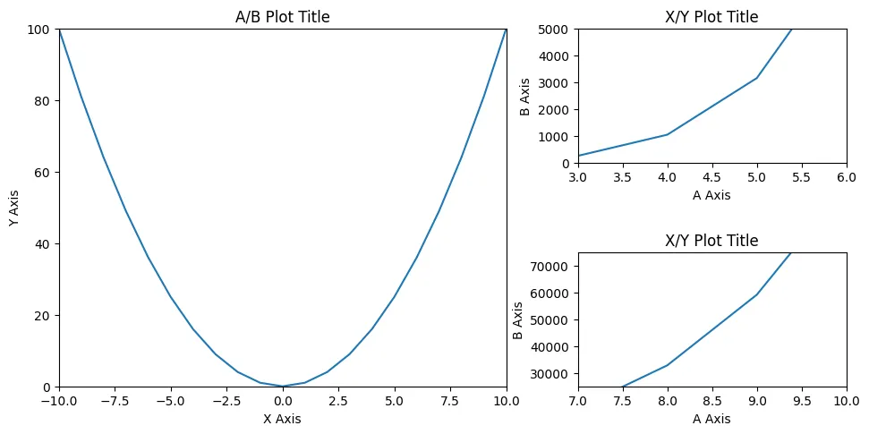

# Matplotlib Pyplot Cheat Sheet 2023


<!-- TOC -->

- [Matplotlib Pyplot Cheat Sheet 2023](#matplotlib-pyplot-cheat-sheet-2023)
  - [Functional API](#functional-api)
    - [Generate Data](#generate-data)
    - [Line Plot](#line-plot)
  - [Figure Object API](#figure-object-api)
    - [Line Plot](#line-plot-1)
    - [Subplots](#subplots)
    - [Legend](#legend)
    - [Styling](#styling)
    - [Logarithmic Axis](#logarithmic-axis)
    - [Polar Axis](#polar-axis)
    - [Twin Axes](#twin-axes)
    - [Annotation](#annotation)
    - [Pie Plot](#pie-plot)
    - [Scatter Plot](#scatter-plot)
    - [Bar Plot](#bar-plot)
    - [Histogram](#histogram)
    - [Box Plot](#box-plot)
    - [Fill Between Plot](#fill-between-plot)
    - [Area under a Curve](#area-under-a-curve)
    - [3D Projection Plot](#3d-projection-plot)
    - [Realtime Animation](#realtime-animation)
    - [E = m\*c²](#e--mc)

<!-- /TOC -->

## Functional API

```python
import matplotlib.pyplot as plt
import numpy as np
from numpy.random import randint
```

### Generate Data

```python
x = np.arange(-10,10)
y = x**2
```

```python
a = np.linspace(0,10,20)
b = a**5+a**2
```

```python
np.random.seed(42)
xz = 4 + np.random.normal(0, 2, 24)
yz = 4 + np.random.normal(0, 2, len(xz))
```

```python
rand = randint(1,50,20)
```

```python
name_array = ['First Dataset', 'Second Dataset', 'Third Dataset']
x_array = [rand, rand-15, rand**(1/2)]
y_array = [rand**(3/4), rand**2, rand**(2/3)]
```

### Line Plot

```python
plt.plot(x, y)
plt.xlabel('X Axis')
plt.ylabel('Y Axis')
plt.xlim(-9, 9)
plt.ylim(0, 80)
plt.title('Smile!')
plt.savefig('assets/Matplotlib_Pyplot_Cheat_Sheet_01.webp')
```




## Figure Object API
### Line Plot

```python
figure = plt.figure(figsize=(10,10))
# add_axes[(lower left corner x,y), width&height of plot inside figure [0-1]]
axes = figure.add_axes([0,0,1,0.2])
# start plot at 0,0 and use 100% width but only 20% height
axes.plot(x, y)
```



```python
fig = plt.figure(figsize=(10,5))

ax_xy = fig.add_axes([0.1,0.1,0.5,0.8])
ax_xy.plot(x, y)
ax_xy.set_xlim(-10, 10)
ax_xy.set_ylim(0, 100)
ax_xy.set_xlabel('X Axis')
ax_xy.set_ylabel('Y Axis')
ax_xy.set_title('A/B Plot Title')

ax_ab_sub1 = fig.add_axes([0.68,0.6,0.3,0.3])
ax_ab_sub1.plot(a, b)
ax_ab_sub1.set_xlim(3,6)
ax_ab_sub1.set_ylim(0, 5000)
ax_ab_sub1.set_xlabel('A Axis')
ax_ab_sub1.set_ylabel('B Axis')
ax_ab_sub1.set_title('X/Y Plot Title')

ax_ab_sub2 = fig.add_axes([0.68,0.1,0.3,0.3])
ax_ab_sub2.plot(a, b)
ax_ab_sub2.set_xlim(7,10)
ax_ab_sub2.set_ylim(25000, 75000)
ax_ab_sub2.set_xlabel('A Axis')
ax_ab_sub2.set_ylabel('B Axis')
ax_ab_sub2.set_title('X/Y Plot Title')

fig.savefig('assets/Matplotlib_Pyplot_Cheat_Sheet_03.webp', bbox_inches='tight')
```




### Subplots

```python
fig, axes = plt.subplots(figsize=(10,5), nrows=1, ncols=2)

axes[0].plot(x, y)
axes[1].plot(a, b)

plt.savefig('assets/Matplotlib_Pyplot_Cheat_Sheet_04.webp')
```


```python
fig, axes = plt.subplots(figsize=(10, 5), nrows=2, ncols=2)

fig.suptitle('Plot Title')

axes[0][0].plot(x, y)
axes[0][0].set_xlabel('X Axis')
axes[0][0].set_ylabel('Y Axis')
axes[0][0].set_title('X/Y Title')

axes[0][1].plot(a, b)
axes[0][1].set_xlabel('A Axis')
axes[0][1].set_ylabel('B Axis')
axes[0][1].set_title('A/B Title')

axes[1][0].plot(a, b)
axes[1][0].set_xlabel('A Axis')
axes[1][0].set_ylabel('B Axis')
axes[1][0].set_title('A/B Title')

axes[1][1].plot(x, y)
axes[1][1].set_xlabel('X Axis')
axes[1][1].set_ylabel('Y Axis')
axes[1][1].set_title('X/Y Title')

fig.subplots_adjust(
    left=None,
    bottom=None,
    right=None,
    top=None,
    wspace=0.5,
    hspace=1
)

plt.savefig('assets/Matplotlib_Pyplot_Cheat_Sheet_05.webp')
```


```python
fig, axes = plt.subplots(figsize=(10,5), nrows=3, ncols=1)

fig.suptitle('I am Scattered')

counter = 0

for ax in axes:
    ax.plot(
        x_array[counter],
        y_array[counter],
        color='g',
        marker='P',
        linestyle='None'
    )
    ax.set_title(name_array[counter])
    counter += 1
    
plt.tight_layout()

plt.savefig('assets/Matplotlib_Pyplot_Cheat_Sheet_06.webp')
```


### Legend

```python
fig = plt.figure(figsize=(12,8))

ax = fig.add_axes([0,0,1,1])

ax.plot(a, a**(4/3), label="x, x**4/3")
ax.plot(a, a, label="x, x")
ax.plot(a, a**(2/3), label="x, x**2/3")
ax.plot(a, a**(1/2), label="x, x**1/2")

ax.legend(loc='upper left')

plt.savefig('assets/Matplotlib_Pyplot_Cheat_Sheet_07.webp', bbox_inches='tight')
```


```python
fig = plt.figure(figsize=(12,8))

ax = fig.add_axes([0,0,1,1])

ax.plot(a, a**(4/3), label="x, x**4/3")
ax.plot(a, a, label="x, x")
ax.plot(a, a**(2/3), label="x, x**2/3")
ax.plot(a, a**(1/2), label="x, x**1/2")

ax.legend(loc=(1.1, 0.9))
plt.tight_layout()

plt.savefig('assets/Matplotlib_Pyplot_Cheat_Sheet_08.webp', bbox_inches='tight')
```


### Styling

```python
fig = plt.figure(figsize=(12,8))

ax = fig.add_axes([0,0,1,1])

ax.plot(
    a,a,
    color='dodgerblue',
    linewidth='5',
    label="a, a"
)
ax.plot(
    a,(a**(3/2)+b**(1/2)),
    color='#fd18d9',
    linestyle='dashed',
    marker='h',
    markersize=16,
    markerfacecolor='lightseagreen',
    markeredgewidth=3,
    markeredgecolor='fuchsia',
    label="a,(a**(3/2)+b**(1/2)"
)
# supported marker styles are: ".", ",", "o", "v", "^", "<", ">", "1", "2", "3", "4", "8", "s", "p", "P", "*", "h", "H", "+", "x", "X", "D", "d", "|", "_"
# supported line styles are '-', '--', '-.', ':', 'None', ' ', '', 'solid', 'dashed', 'dashdot', 'dotted'

ax.legend()

plt.savefig('assets/Matplotlib_Pyplot_Cheat_Sheet_09.webp', bbox_inches='tight')
```


### Logarithmic Axis

```python
fig, ax = plt.subplots(1, 2, figsize=(12,8))

ax[0].plot(a,a,label="a, a")
ax[0].plot(a,(a**(3/2)+b**(1/2)),label="a,(a**(3/2)+b**(1/2)")
ax[0].grid(True)
ax[0].legend()
ax[0].set_title('Linear Scale')

ax[1].plot(a,a,label="a, a")
ax[1].plot(a,(a**(3/2)+b**(1/2)),label="a,(a**(3/2)+b**(1/2)")
ax[1].set_yscale('log')
ax[1].grid(True)
ax[1].legend()
ax[1].set_title('Log Scale')

plt.savefig('assets/Matplotlib_Pyplot_Cheat_Sheet_10.webp', bbox_inches='tight')
```


### Polar Axis

```python
np.random.seed(42)
N = 40
theta = np.linspace(0.0, 2*np.pi, N, endpoint=False)
radii = 10*np.random.rand(N)
width = np.pi/4*np.random.rand(N)
colours = plt.cm.winter(radii/10)
```

```python
plt.figure(figsize=(10,10))
ax = plt.subplot(1,1,1, projection='polar')
ax.bar(
    theta,
    radii,
    width=width,
    bottom=0,
    color=colours,
    alpha=0.7
)
ax.set_title('Polar Bar Chart')

plt.savefig('assets/Matplotlib_Pyplot_Cheat_Sheet_27.webp', bbox_inches='tight')
```


```python
radii2 = np.arange(0, 2, 0.01)
theta2 = 2*np.pi*radii2
```

```python
plt.figure(figsize=(10,10))

ax = plt.subplot(111, projection='polar')
ax.plot(theta2, radii2, color='mediumspringgreen')
ax.set_rmax(2)
ax.set_rticks([0, 0.5, 1.5])
ax.set_title('Polar Line Chart')

plt.savefig('assets/Matplotlib_Pyplot_Cheat_Sheet_28.webp', bbox_inches='tight')
```


```python
np.random.seed(42)
N = 200
radii3 = 3*np.random.rand(N)
theta3 = 2*np.pi*np.random.rand(N)
area = 50*2*np.pi*radii3**2
colours = theta3
```

```python
fig = plt.figure(figsize=(10,10))

ax = fig.add_subplot(111, projection='polar')
plot = ax.scatter(theta3, radii3, c=colours, s=area, cmap='spring', alpha=0.8)

plt.savefig('assets/Matplotlib_Pyplot_Cheat_Sheet_29.webp', bbox_inches='tight')
```


### Twin Axes

```python
fig, ax1 = plt.subplots(figsize=(12,8))

ax1.plot(a,(a**(3/2)+b**(1/2)), lw=2, color='dodgerblue')
ax1.set_ylabel(r"area $(m^2)$", fontsize=18, color='dodgerblue')
for label in ax1.get_yticklabels():
    label.set_color('dodgerblue')

ax2 = ax1.twinx()
ax2.plot(a,(a**(4/3)+b**(2/3)), lw=2, color='mediumorchid')
ax2.set_ylabel(r"volume $(m^3)$", fontsize=18, color='mediumorchid')
for label in ax2.get_yticklabels():
    label.set_color('mediumorchid')

plt.savefig('assets/Matplotlib_Pyplot_Cheat_Sheet_11.webp', bbox_inches='tight')
```


### Annotation

```python
fig, ax = plt.subplots(figsize=(12,8))
ax.set_title('Plot Annotation')
ax.plot(x**2+x, x**3)

plt.annotate(
    text='Wooh!',
    xy=(0, 0),
    xycoords='data',
    xytext=(0.3, 0.3),
    textcoords='axes fraction',
    va='top', ha='left',
    arrowprops=dict(facecolor='tomato', shrink=0),
    color='royalblue',
    weight='heavy'
)

plt.savefig('assets/Matplotlib_Pyplot_Cheat_Sheet_12.webp', bbox_inches='tight')
```


### Pie Plot

```python
plt.pie(d)
plt.title('Pie Chart')

plt.savefig('assets/Matplotlib_Pyplot_Cheat_Sheet_13.webp', bbox_inches='tight')
```


```python
d = [1, 2, 5, 7, 5, 7, 2]
e = (0., 0.05, 0.05, 0., 0., 0., 0.)
pie_labels = ['Cupim', 'Velit', 'Nulla', 'Leberkas', 'Cillum', 'Incididunt', 'Fugiat']
```

```python
colors = plt.get_cmap('cool')(np.linspace(0.2, 0.7, len(d)))

fig, ax = plt.subplots(figsize=(10,10))

wedges, texts, autotexts = ax.pie(
    d,
    autopct='%1.1f%%',
    pctdistance=0.6,
    colors=colors,
    labels = pie_labels,
    labeldistance=1.15,
    explode=e,
    startangle=130,
    wedgeprops={"linewidth": 1, "edgecolor": "white"},
    shadow=True
)

plt.setp(autotexts, size=13, color='white')
plt.setp(texts, size=14, color='darkslategray')
ax.set_title('Andouille Biltong Voluptate')

# ax.set(xlim=(0, 8), xticks=np.arange(1, 8),
#        ylim=(0, 8), yticks=np.arange(1, 8))

fig.savefig('assets/Matplotlib_Pyplot_Cheat_Sheet_14.webp', bbox_inches='tight')
```


```python
fig, ax = plt.subplots(figsize=(10,10))
size = 0.3

values = np.array([[88,44], [22,77], [99,11]])
value_sum = values.sum(axis=1)
value_flat = values.flatten()

value_sum_labels = ['Cupim', 'Velit', 'Nulla']
value_flat_labels = ['Leberkas', 'Cillum', 'Incididunt', 'Fugiat', 'Kielbasa', 'Picanha']

cmap = plt.get_cmap('cool')
outer_colors = cmap(np.linspace(0.1, 0.4, len(value_sum)))
inner_colors = cmap(np.linspace(0.5, 0.9, len(value_sum)))

wedges, texts, autotexts = ax.pie(
    value_sum,
    radius = 1,
    colors = outer_colors,
    labels = value_sum_labels,
    autopct='%1.1f%%',
    pctdistance=0.8,
    wedgeprops = {
        'linewidth': 1,
        'width': size,
        'edgecolor': "white"
    }
)

plt.setp(autotexts, size=13, color='white')
plt.setp(texts, size=14, color='darkslategray')

wedges2, texts2, autotexts2 = ax.pie(
    value_flat,
    radius = 1 - size,
    colors = inner_colors,
    labels = value_flat_labels,
    labeldistance=0.22,
    autopct='%1.1f%%',
    pctdistance=0.8,
    wedgeprops = {
        'linewidth': 1,
        'width': size,
        'edgecolor': "white"
    }
)

plt.setp(autotexts2, size=13, color='white')
plt.setp(texts2, size=10, color='darkslategray')

ax.set_title('Et Donut Burgdoggen Exercitatione')

fig.savefig('assets/Matplotlib_Pyplot_Cheat_Sheet_25.webp', bbox_inches='tight')
```


```python
measurements = [
    '323 ppm Cupim',
    '72 ppm Velit',
    '112 ppm Nulla',
    '224 ppm Cillum',
    '56 ppm Incididunt'
]

results = [float(x.split(' ')[0]) for x in measurements]
substances = [str(x.split(' ')[-1]) for x in measurements]

def percentage(pct, values):
    absolute = int(pct/100. * np.sum(values))
    return '{:.1f}%\n({:d} ppm)'.format(pct, absolute)
```

```python
fig, ax = plt.subplots(figsize=(10,10))

wedges, texts, autotexts = ax.pie(
    result,
    autopct = lambda pct: percentage(pct, results)
)

ax.legend(
    wedges,
    substances,
    title = 'Measurement',
    bbox_to_anchor = (0.5, 0, 0.5, 1)
)

plt.setp(autotexts, size=13, color='white')
plt.setp(texts, size=14, color='darkslategray')

fig.savefig('assets/Matplotlib_Pyplot_Cheat_Sheet_26.webp', bbox_inches='tight')
```


### Scatter Plot

```python
plt.scatter(xz,yz)
plt.title('Scatter Plot')

plt.savefig('assets/Matplotlib_Pyplot_Cheat_Sheet_15.webp', bbox_inches='tight')
```


```python
# size and color:
sizes = np.random.uniform(15, 80, len(xz))
colors = np.random.uniform(15, 80, len(xz))

fig, ax = plt.subplots()
ax.scatter(xz, yz, s=sizes, c=colors, vmin=0, vmax=100)
ax.set_title('Scatter Chart')
ax.set(xlim=(0, 8), xticks=np.arange(1, 8),
       ylim=(0, 8), yticks=np.arange(1, 8))

fig.savefig('assets/Matplotlib_Pyplot_Cheat_Sheet_16.webp', bbox_inches='tight')
```


### Bar Plot

```python
plt.bar(a,b)
plt.title('Bar Chart')

plt.savefig('assets/Matplotlib_Pyplot_Cheat_Sheet_17.webp', bbox_inches='tight')
```


```python
fig, ax = plt.subplots()

ax.bar(x, y, width=0.6, edgecolor="white", linewidth=0.7)
ax.set_title('Bar Chart')
ax.set(xlim=(0, 10), xticks=np.arange(1, 10),
       ylim=(0, 110))

plt.savefig('assets/Matplotlib_Pyplot_Cheat_Sheet_18.webp', bbox_inches='tight')
```


### Histogram

```python
bins = np.linspace(0,20,20)

plt.hist(
    y_array[0],
    bins=bins,
    rwidth=0.8
)
plt.title('Histogram')

plt.savefig('assets/Matplotlib_Pyplot_Cheat_Sheet_19.webp', bbox_inches='tight')
```


```python
fig, ax = plt.subplots()
ax.hist(xs, bins=8, linewidth=0.5, edgecolor="white")
ax.set_title('Histogram')
ax.set(xlim=(22, 33), xticks=np.arange(22, 33),
        ylim=(0, 20), yticks=np.linspace(0, 18, 9))

plt.savefig('assets/Matplotlib_Pyplot_Cheat_Sheet_20.webp', bbox_inches='tight')
```


### Box Plot

```python
# generate two datasets - one with a standard deviation of 1 the other with std=2
data = [np.random.normal(0, std, 100) for std in range(1,3)]
```

```python
plt.boxplot(data, vert=True, patch_artist=True)
plt.title('STD Boxplot')
plt.savefig('assets/Matplotlib_Pyplot_Cheat_Sheet_24.webp', bbox_inches='tight')
```


### Fill Between Plot

```python
fig, ax = plt.subplots()

ax.fill_between(x, y, y**(1/2), alpha=.5, linewidth=0)
ax.plot(x, (y + y**(1/2))/2, linewidth=2)
ax.set_title('Fill Between Chart')
ax.set(xlim=(-10, 10), xticks=np.arange(-10, 10),
        ylim=(0, 100))

plt.savefig('assets/Matplotlib_Pyplot_Cheat_Sheet_21.webp', bbox_inches='tight')
```


### Area under a Curve

```python
from matplotlib.patches import Polygon
```

```python
def f(x):
    return (x-3) * (x-4) * (x-7) + 77

a, b = 2, 9
x = np.linspace(0,10)
y = f(x)
```

```python
fig, ax = plt.subplots(figsize=(12,8))

ax.plot(x, y, color='fuchsia', linewidth=2)
ax.set_title('Integral of the Area under the Curve')
ax.set_xlabel('X')
ax.set_ylabel('Y')
ax.spines['right'].set_visible(False)
ax.spines['top'].set_visible(False)

# select section of curve
ax.set_ylim(bottom=0)
ix = np.linspace(a,b)
iy = f(ix)
verts = [(a, 0), *zip(ix,iy), (b, 0)]
ax.set_xticks((a,b))
ax.set_xticklabels(('a','b'))
ax.set_yticks((f(a),f(b)))
ax.set_yticklabels(('f(a)','f(b)'))

# draw polygon under selection
poly = Polygon(verts, facecolor='dodgerblue', edgecolor='fuchsia')
ax.add_patch(poly)
# annotate
ax.text(
    0.5*(a+b), 30,
    r'$\int_a^b f(x)\mathrm{d}x$',
    color='white',
    fontsize='xx-large'
)

plt.savefig('assets/Matplotlib_Pyplot_Cheat_Sheet_30.webp', bbox_inches='tight')
```


```python
# i am not sure if `from matplotlib.patches import Polygon`
# has a method to calculate the area of a polygon?
# but it does work with `pip install shaply`:
from shapely.geometry import Polygon
polygon = Polygon(verts)
polygon.area
# 571.1428571428572
```

### 3D Projection Plot

```python
np.random.seed(42)
n = 100
rng = np.random.default_rng()
xs = rng.uniform(23, 32, n)
ys = rng.uniform(0, 100, n)
zs = rng.uniform(-50, -25, n)
```

```python
fig = plt.figure(figsize=(10,10))
ax = plt.axes(projection='3d')
ax.set_title('3D Line Chart')
ax.plot3D(xs, ys, zs)

plt.savefig('assets/Matplotlib_Pyplot_Cheat_Sheet_22.webp', bbox_inches='tight')
```


```python
fig, ax = plt.subplots(figsize=(12,8), subplot_kw={"projection": "3d"})

ax.scatter(xs, ys, zs)
ax.set_title('3D Scatterplot')
ax.set(xticklabels=[],
       yticklabels=[],
       zticklabels=[])

fig.savefig('assets/Matplotlib_Pyplot_Cheat_Sheet_23.webp', bbox_inches='tight')
```


### Realtime Animation

```python
from matplotlib.animation import FuncAnimation
from psutil import cpu_percent
from datetime import datetime
```

```python
usage = []
```

```python
cpu_use = cpu_percent()
usage.append((datetime.utcnow(), cpu_use))
usage
#[(datetime.datetime(2023, 5, 6, 8, 43, 39, 187158), 13.3),
#  (datetime.datetime(2023, 5, 6, 8, 43, 40, 67655), 12.2),
#  (datetime.datetime(2023, 5, 6, 8, 43, 40, 744222), 14.7)]
```

```python
plt.plot(*zip(*usage), color='mediumspringgreen')
plt.title('CPU Usage in Percent')
plt.savefig('assets/Matplotlib_Pyplot_Cheat_Sheet_31.webp', bbox_inches='tight')
```


```python
%matplotlib notebook
# only display 200 data points
frame_len = 200
data_points=[]

fig = plt.figure(figsize=(8,5))
fig.suptitle('Realtime CPU Usage [%]')

plt.ylim(1,100)
plt.tight_layout()

def animation(i):
    data_points.append((datetime.utcnow(), cpu_percent()))
    
    if len(y) <= frame_len:
        plt.cla()
        plt.plot(*zip(*data_points), color='mediumspringgreen', label='CPU Usage [%]')
    else:
        plt.cla()
        plt.plot(data_points[-frame_len:],color='mediumspringgreen', label='CPU Usage [%]')
        
anime = FuncAnimation(plt.gcf(), animation, interval=1000)
```


### E = m*c²

```python
from scipy import constants as sc
```

```python
c_vac = sc.speed_of_light
mass = np.linspace(0,100)

def energy_conversion(mass):
    return mass * c_vac**2

energy = energy_conversion(mass)
```

```python
fig = plt.figure(figsize=(8,5))
fig.suptitle('Mass to Energy Conversion')

plt.xlabel('Mass')
plt.ylabel('Energy')
plt.legend()
plt.plot(mass, energy, label='E = m*c²')
```

```python
fig = plt.figure(figsize=(8,5))
fig.suptitle('Mass to Energy Conversion')

ax = fig.add_axes([0,0,1,1])

ax.plot(
    mass,energy,
    color='#fd18d9',
    linestyle='dashed',
    marker='h',
    markersize=8,
    markerfacecolor='lightseagreen',
    markeredgewidth=2,
    markeredgecolor='fuchsia',
    label="E = m*c²"
)

ax.legend(loc='upper left')
ax.set_xlabel('Mass')
ax.set_ylabel('Energy')

plt.savefig('assets/Matplotlib_Pyplot_Cheat_Sheet_33.webp', bbox_inches='tight')
```


```python
fig, ax = plt.subplots(1, 2, figsize=(12,8))

ax[0].plot(
    mass,energy,
    color='lightseagreen',
    linestyle='dashed',
    label="E = m*c²"
)
ax[0].legend()
ax[0].set_xlabel('Mass')
ax[0].set_ylabel('Energy')
ax[0].grid(True)
ax[0].set_title('E = m*c²')

ax[1].plot(
    mass,energy,
    color='dodgerblue',
    linestyle='dashed',
    label="E = m*c²"
)
ax[1].set_yscale('log')
ax[1].grid(True)
ax[1].legend()
ax[1].set_xlabel('Mass')
ax[1].set_ylabel('Energy')
ax[1].set_title('E = m*c² (log)')

plt.savefig('assets/Matplotlib_Pyplot_Cheat_Sheet_34.webp', bbox_inches='tight')
```

